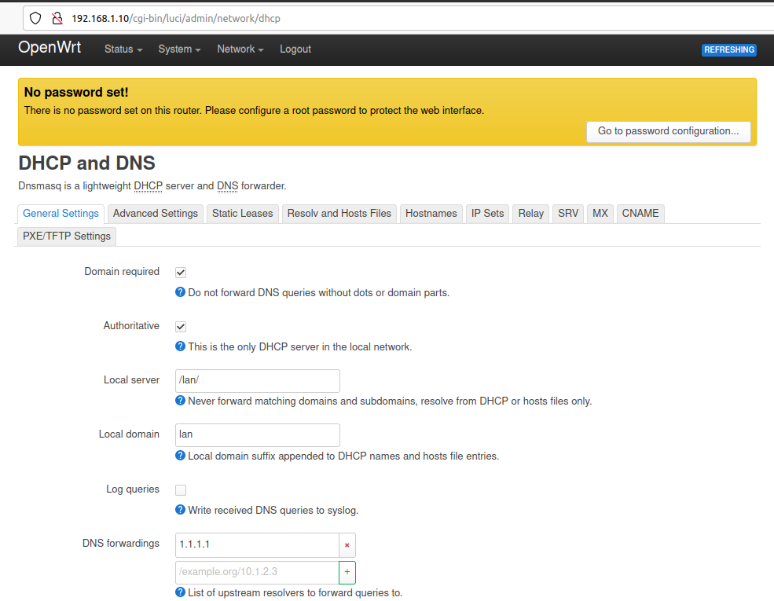

= Raspberry Pi

== OpenWRT

.Download proper IMG file matching model
link:https://openwrt.org/toh/raspberry_pi_foundation/raspberry_pi[]

.Flash SD card with tools like Balena or standard commands
[source,bash]
----
gzip -d imagename-factory.img.gz
dd if=imagename-factory.img of=/dev/sdX bs=2M conv=fsync
sync
----

.Disconnect from network cable, boot RPi with screen and keyboard

.Initial boot (commands local)
[source,bash]
----
# once booted, there is local prompt for command lines

# Force Static IP address of your choice
$ ifconfig br-lan 192.168.1.10 netmak 255.255.255.0

# Set your WAN gateway
$ route add default gw 192.168.1.1
----

.Connect the Network cable RJ45 to RPi

.Open Browser to chosen IP Address link:http://192.168.1.10[]

.Setup DNS if necessary

.SSH installation (commands remote)
[source,bash]
----
# SSH connect using root/(empty)

$ ssh root@192.168.1.10

BusyBox v1.36.1 (2023-10-09 21:45:35 UTC) built-in shell (ash)

  _______                     ________        __
 |       |.-----.-----.-----.|  |  |  |.----.|  |_
 |   -   ||  _  |  -__|     ||  |  |  ||   _||   _|
 |_______||   __|_____|__|__||________||__|  |____|
          |__| W I R E L E S S   F R E E D O M
 -----------------------------------------------------
 OpenWrt 23.05.0, r23497-6637af95aa
 -----------------------------------------------------
=== WARNING! =====================================
There is no root password defined on this device!
Use the "passwd" command to set up a new password
in order to prevent unauthorized SSH logins.
--------------------------------------------------

#  Check IP  Addresses

root@OpenWrt:~# ip addr show
1: lo: <LOOPBACK,UP,LOWER_UP> mtu 65536 qdisc noqueue state UNKNOWN qlen 1000
    link/loopback 00:00:00:00:00:00 brd 00:00:00:00:00:00
    inet 127.0.0.1/8 scope host lo
       valid_lft forever preferred_lft forever
    inet6 ::1/128 scope host 
       valid_lft forever preferred_lft forever
2: eth0: <BROADCAST,MULTICAST,UP,LOWER_UP> mtu 1500 qdisc fq_codel master br-lan state UP qlen 1000
    link/ether b8:37:eb:b9:ae:45 brd ff:ff:ff:ff:ff:ff
3: br-lan: <BROADCAST,MULTICAST,UP,LOWER_UP> mtu 1500 qdisc noqueue state UP qlen 1000
    link/ether b8:37:eb:b9:ae:45 brd ff:ff:ff:ff:ff:ff
    inet 192.168.1.10/24 brd 192.168.1.255 scope global br-lan
       valid_lft forever preferred_lft forever
    inet6 fd7d:55c8:c0ec::1/60 scope global noprefixroute 
       valid_lft forever preferred_lft forever
    inet6 fe80::ba45:ebff:feb3:ae45/64 scope link 
       valid_lft forever preferred_lft forever

# Check Internet connection

root@OpenWrt:~# ping google.com
PING google.com (142.250.74.238): 56 data bytes
64 bytes from 142.250.74.238: seq=0 ttl=110 time=37.446 ms
64 bytes from 142.250.74.238: seq=1 ttl=110 time=38.932 ms
----

[TIP]
====
# Update packages
$ opkg update

# Upgrade all packages
$ opkg list-upgradable | cut -f 1 -d ' ' | xargs -r opkg upgrade 
====

.SSH installation - Update packages
[source,bash,collapsible=true]
----
# Update packages

root@OpenWrt:~# opkg update
Downloading https://downloads.openwrt.org/releases/23.05.0/targets/bcm27xx/bcm2709/packages/Packages.gz
Updated list of available packages in /var/opkg-lists/openwrt_core
Downloading https://downloads.openwrt.org/releases/23.05.0/targets/bcm27xx/bcm2709/packages/Packages.sig
Signature check passed.
Downloading https://downloads.openwrt.org/releases/23.05.0/packages/arm_cortex-a7_neon-vfpv4/base/Packages.gz
Updated list of available packages in /var/opkg-lists/openwrt_base
Downloading https://downloads.openwrt.org/releases/23.05.0/packages/arm_cortex-a7_neon-vfpv4/base/Packages.sig
Signature check passed.
Downloading https://downloads.openwrt.org/releases/23.05.0/packages/arm_cortex-a7_neon-vfpv4/luci/Packages.gz
Updated list of available packages in /var/opkg-lists/openwrt_luci
Downloading https://downloads.openwrt.org/releases/23.05.0/packages/arm_cortex-a7_neon-vfpv4/luci/Packages.sig
Signature check passed.
Downloading https://downloads.openwrt.org/releases/23.05.0/packages/arm_cortex-a7_neon-vfpv4/packages/Packages.gz
Updated list of available packages in /var/opkg-lists/openwrt_packages
Downloading https://downloads.openwrt.org/releases/23.05.0/packages/arm_cortex-a7_neon-vfpv4/packages/Packages.sig
Signature check passed.
Downloading https://downloads.openwrt.org/releases/23.05.0/packages/arm_cortex-a7_neon-vfpv4/routing/Packages.gz
Updated list of available packages in /var/opkg-lists/openwrt_routing
Downloading https://downloads.openwrt.org/releases/23.05.0/packages/arm_cortex-a7_neon-vfpv4/routing/Packages.sig
Signature check passed.
Downloading https://downloads.openwrt.org/releases/23.05.0/packages/arm_cortex-a7_neon-vfpv4/telephony/Packages.gz
Updated list of available packages in /var/opkg-lists/openwrt_telephony
Downloading https://downloads.openwrt.org/releases/23.05.0/packages/arm_cortex-a7_neon-vfpv4/telephony/Packages.sig
Signature check passed.
----

[TIP]
====
# Install Packages for USB
$ opkg install kmod-usb-storage kmod-usb-uhci kmod-usb2 kmod-usb3

# Install Packages for iPhone
$ opkg install kmod-usb-net-ipheth usbmuxd libimobiledevice usbutils
====

.SSH installation - Install packages (USB, iPhone, Android)
[source,bash,collapsible=true]
----
# Install Packages for USB

root@OpenWrt:~# opkg install kmod-usb-storage kmod-usb-uhci kmod-usb2 kmod-usb3
Installing kmod-usb-storage (5.15.134-1) to root...
Downloading https://downloads.openwrt.org/releases/23.05.0/targets/bcm27xx/bcm2709/packages/kmod-usb-storage_5.15.134-1_arm_cortex-a7_neon-vfpv4.ipk
Installing kmod-scsi-core (5.15.134-1) to root...
Downloading https://downloads.openwrt.org/releases/23.05.0/targets/bcm27xx/bcm2709/packages/kmod-scsi-core_5.15.134-1_arm_cortex-a7_neon-vfpv4.ipk
Configuring kmod-scsi-core.
Configuring kmod-usb-storage.
Installing kmod-usb-uhci (5.15.134-1) to root...
Downloading https://downloads.openwrt.org/releases/23.05.0/targets/bcm27xx/bcm2709/packages/kmod-usb-uhci_5.15.134-1_arm_cortex-a7_neon-vfpv4.ipk
Configuring kmod-usb-uhci.
Installing kmod-usb2 (5.15.134-1) to root...
Downloading https://downloads.openwrt.org/releases/23.05.0/targets/bcm27xx/bcm2709/packages/kmod-usb2_5.15.134-1_arm_cortex-a7_neon-vfpv4.ipk
Installing kmod-usb-ehci (5.15.134-1) to root...
Downloading https://downloads.openwrt.org/releases/23.05.0/targets/bcm27xx/bcm2709/packages/kmod-usb-ehci_5.15.134-1_arm_cortex-a7_neon-vfpv4.ipk
Configuring kmod-usb-ehci.
Configuring kmod-usb2.
Installing kmod-usb3 (5.15.134-1) to root...
Downloading https://downloads.openwrt.org/releases/23.05.0/targets/bcm27xx/bcm2709/packages/kmod-usb3_5.15.134-1_arm_cortex-a7_neon-vfpv4.ipk
Installing kmod-usb-xhci-hcd (5.15.134-1) to root...
Downloading https://downloads.openwrt.org/releases/23.05.0/targets/bcm27xx/bcm2709/packages/kmod-usb-xhci-hcd_5.15.134-1_arm_cortex-a7_neon-vfpv4.ipk
Configuring kmod-usb-xhci-hcd.
Configuring kmod-usb3.

# Install Packages for iPhone

root@OpenWrt:~# opkg install kmod-usb-net-ipheth usbmuxd libimobiledevice usbutils
Installing kmod-usb-net-ipheth (5.15.134-1) to root...
Downloading https://downloads.openwrt.org/releases/23.05.0/targets/bcm27xx/bcm2709/packages/kmod-usb-net-ipheth_5.15.134-1_arm_cortex-a7_neon-vfpv4.ipk
Installing kmod-mii (5.15.134-1) to root...
Downloading https://downloads.openwrt.org/releases/23.05.0/targets/bcm27xx/bcm2709/packages/kmod-mii_5.15.134-1_arm_cortex-a7_neon-vfpv4.ipk
Installing kmod-usb-net (5.15.134-1) to root...
Downloading https://downloads.openwrt.org/releases/23.05.0/targets/bcm27xx/bcm2709/packages/kmod-usb-net_5.15.134-1_arm_cortex-a7_neon-vfpv4.ipk
Configuring kmod-mii.
Configuring kmod-usb-net.
Configuring kmod-usb-net-ipheth.
Installing usbmuxd (1.1.1-1) to root...
Downloading https://downloads.openwrt.org/releases/23.05.0/packages/arm_cortex-a7_neon-vfpv4/packages/usbmuxd_1.1.1-1_arm_cortex-a7_neon-vfpv4.ipk
Installing libatomic1 (12.3.0-4) to root...
Downloading https://downloads.openwrt.org/releases/23.05.0/targets/bcm27xx/bcm2709/packages/libatomic1_12.3.0-4_arm_cortex-a7_neon-vfpv4.ipk
Installing libusb-1.0-0 (1.0.26-3) to root...
Downloading https://downloads.openwrt.org/releases/23.05.0/packages/arm_cortex-a7_neon-vfpv4/base/libusb-1.0-0_1.0.26-3_arm_cortex-a7_neon-vfpv4.ipk
Installing zlib (1.2.13-1) to root...
Downloading https://downloads.openwrt.org/releases/23.05.0/packages/arm_cortex-a7_neon-vfpv4/base/zlib_1.2.13-1_arm_cortex-a7_neon-vfpv4.ipk
Installing libxml2 (2.11.4-1) to root...
Downloading https://downloads.openwrt.org/releases/23.05.0/packages/arm_cortex-a7_neon-vfpv4/base/libxml2_2.11.4-1_arm_cortex-a7_neon-vfpv4.ipk
Installing libplist (2.2.0-3) to root...
Downloading https://downloads.openwrt.org/releases/23.05.0/packages/arm_cortex-a7_neon-vfpv4/packages/libplist_2.2.0-3_arm_cortex-a7_neon-vfpv4.ipk
Installing libusbmuxd (2.0.2-1) to root...
Downloading https://downloads.openwrt.org/releases/23.05.0/packages/arm_cortex-a7_neon-vfpv4/packages/libusbmuxd_2.0.2-1_arm_cortex-a7_neon-vfpv4.ipk
Installing libopenssl3 (3.0.12-1) to root...
Downloading https://downloads.openwrt.org/releases/23.05.0/packages/arm_cortex-a7_neon-vfpv4/base/libopenssl3_3.0.12-1_arm_cortex-a7_neon-vfpv4.ipk
Installing libimobiledevice (1.3.0-2) to root...
Downloading https://downloads.openwrt.org/releases/23.05.0/packages/arm_cortex-a7_neon-vfpv4/packages/libimobiledevice_1.3.0-2_arm_cortex-a7_neon-vfpv4.ipk
Configuring libatomic1.
Configuring libopenssl3.
Configuring libusb-1.0-0.
Configuring zlib.
Configuring libxml2.
Configuring libplist.
Configuring libusbmuxd.
Configuring libimobiledevice.
Configuring usbmuxd.
Package libimobiledevice (1.3.0-2) installed in root is up to date.
Installing usbutils (014-1) to root...
Downloading https://downloads.openwrt.org/releases/23.05.0/packages/arm_cortex-a7_neon-vfpv4/packages/usbutils_014-1_arm_cortex-a7_neon-vfpv4.ipk
Installing libevdev (1.13.0-1) to root...
Downloading https://downloads.openwrt.org/releases/23.05.0/packages/arm_cortex-a7_neon-vfpv4/packages/libevdev_1.13.0-1_arm_cortex-a7_neon-vfpv4.ipk
Installing libudev-zero (1.0.1-1) to root...
Downloading https://downloads.openwrt.org/releases/23.05.0/packages/arm_cortex-a7_neon-vfpv4/packages/libudev-zero_1.0.1-1_arm_cortex-a7_neon-vfpv4.ipk
Configuring libevdev.
Configuring libudev-zero.
Configuring usbutils.

