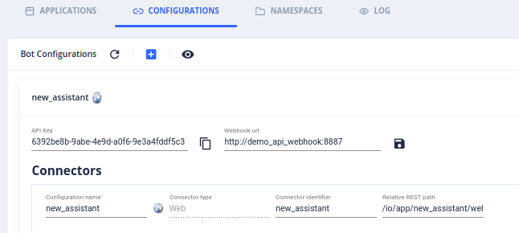

= Tock
:hardbreaks:

This is slightly modified link:https://github.com/theopenconversationkit/tock-docker[Tock Bot API stack]

== Usage

=== Environment up/down

.Commands
[source,bash]
----
$ make start
$ make stop
$ make clean
----

IMPORTANT: Tock Studio is at *http://localhost:5080* and has creds *admin@app.com / password*

IMPORTANT: at first connection, you are asked to create an app by 3 questions, language, etc. This ends as below app usage.

.Test stack works => run command against default namespace/bot/connector
[source, bash]
----
$ curl localhost:5082/io/app/new_assistant/web -d '{ "query": "Hello!", "userId": "ID_00001" }' | jq .
  % Total    % Received % Xferd  Average Speed   Time    Time     Time  Current
                                 Dload  Upload   Total   Spent    Left  Speed
100   133  100    90  100    43    608    290 --:--:-- --:--:-- --:--:--   898
{
  "responses": [
    {
      "type": "WebMessage",
      "text": "Sorry, I didn't understand :(",
      "version": "1"
    }
  ]
}
----

=== Testing

==== WebHook (not advised)

.Configure WebHook *http://demo_api_webhook:8887*

.Test webhook works => run command against default namespace/bot/connector
[source, bash]
----
$ curl localhost:5082/io/app/new_assistant/web -d '{ "query": "Coucou", "userId": "ID_00001" }' | jq .
  % Total    % Received % Xferd  Average Speed   Time    Time     Time  Current
                                 Dload  Upload   Total   Spent    Left  Speed
100   396  100   353  100    43   5268    641 --:--:-- --:--:-- --:--:--  5910
{
  "responses": [
    {
      "type": "WebMessage",
      "text": "Sorry - not understood",
      "buttons": [
        {
          "clazz": "postback_button",
          "title": "Card",
          "payload": "card?_previous_intent=unknown&_source=new_assistant",
          "type": "postback"
        },
        {
          "clazz": "postback_button",
          "title": "Carousel",
          "payload": "carousel?_previous_intent=unknown&_source=new_assistant",
          "type": "postback"
        }
      ],
      "version": "1"
    }
  ]
}
----

==== WebSocket (advised)

.Check a sample nodeJS bot works
* in Settings, import (button Upload Dump):
** app, use file ipa_test_app.json
** sentence, use file ipa_test_sentences.json
* Edit samples/tock-bot-node/main.js and set proper token for the imported bot *ipa_test*
* now build and run the bot

[source,bash,collapse="true"]
----
# Build
$ docker-compose build demo_api_ws_node

# Run
$ docker-compose up -d demo_api_ws_node

# Use => bonjour => que puis-je pour vous ?
$ curl localhost:5082/io/app/ipa_test/web --data '{"query":"bonjour","userId":"id"}' | jq .
  % Total    % Received % Xferd  Average Speed   Time    Time     Time  Current
                                 Dload  Upload   Total   Spent    Left  Speed
100   117  100    84  100    33    661    259 --:--:-- --:--:-- --:--:--   921
{
  "responses": [
    {
      "type": "WebMessage",
      "text": "que puis-je pour vous ?",
      "version": "1"
    }
  ]
}

# Use => allumer la lumière => j'allume la lumière
$ curl localhost:5082/io/app/ipa_test/web --data '{"query":"allumer la lumière","userId":"id"}' | jq .
  % Total    % Received % Xferd  Average Speed   Time    Time     Time  Current
                                 Dload  Upload   Total   Spent    Left  Speed
100   126  100    81  100    45    931    517 --:--:-- --:--:-- --:--:--  1448
{
  "responses": [
    {
      "type": "WebMessage",
      "text": "j'allume la lumière",
      "version": "1"
    }
  ]
}

# Check Bot logs
$ docker logs -f tock_demo_api_ws_node_1
Connecting to ws://bot_api:8080/6d544b70-b0bf-4f7c-9cf7-11889b33a3a9
Connection established
intent greeting/bonjour
undefined
bonjour
[]
intent greeting/bonjour
{}
bonjour
[]
intent allumer
{}
allumer la lumière
[ { type: 'app:action',
    role: 'domotiqueaction',
    content: 'allumer',
    evaluated: false,
    subEntities: [],
    new: true },
  { type: 'app:appliance',
    role: 'domotiqueappliance',
    content: 'lumière',
    evaluated: false,
    subEntities: [],
    new: true } ]
----

// .Check link:https://github.com/theopenconversationkit/tock-bot-samples[Kotlin Bot API]
// * uncomment section in docker-compose.demo.yml
// [source,bash]
// ----
//   # tock-bot-samples:
//   #   build: tock-bot-samples
//   #   environment:
//   #     - tock_env=integ
//   #   ports:
//   #     - "5089:8887"
// ----

// * Edit *tock-bot-samples/src/main/kotlin/StartWebsocketWithLocalhost.kt* to setup host API Key as seen in Tock Studio

== References

=== Tock

* link:https://doc.tock.ai/tock/fr/user/concepts/[Tock Concepts]
* link:http://doc.tock.ai/tock/api/web-connector#/[Tock Swagger API]

* link:https://flows.nodered.org/search?term=linto[Linto node-red]

* APIs:
** link:http://doc.tock.ai/tock/api/web-connector[Tock Bot API]
** link:http://doc.tock.ai/tock/api/#/Nlp/parse[Tock NLP API]
** link:http://doc.tock.ai/tock/api/admin[Tock Admin API]

=== NLP.JS

* link:https://github.com/rodrigopivi/Chatito[Chatito]